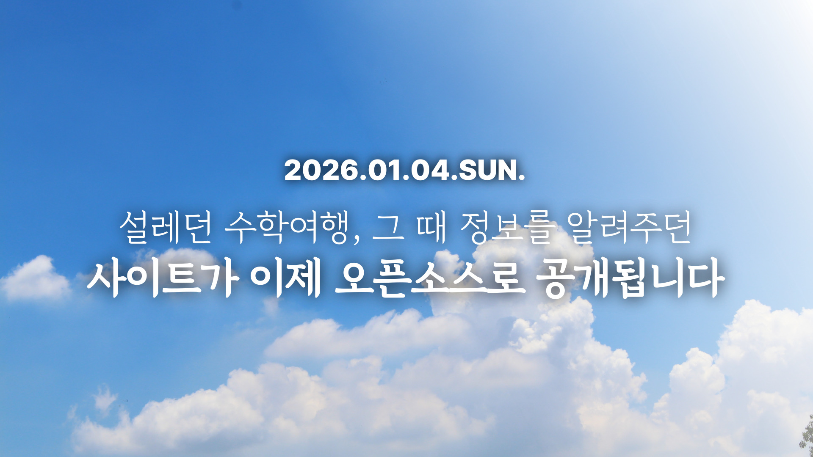
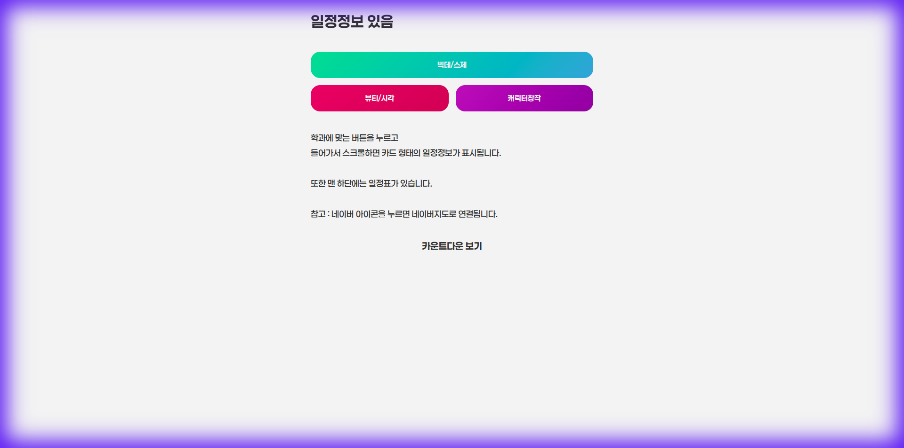
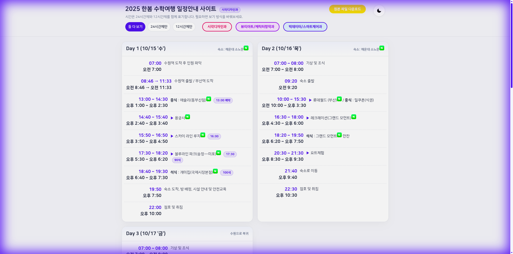

# HBTrip.info - 2025 한봄 수학여행 일정 안내 사이트

> [!IMPORTANT]
> **오픈소스 선언**
> 2026년 1월 4일, 제작자 **Rheehose (Rhee Creative)**가 이 프로젝트의 모든 소스 코드를 오픈소스로 공개합니다.

## 🌟 프로젝트 소개

**HBTrip.info**는 2025년 한봄고등학교 부산 수학여행의 일정 안내를 위해 제작된 웹사이트입니다. 각 학과(시각디자인, 뷰티아트&캐릭터창작, 빅데이터정보&스마트제어) 맞춤형 일정을 제공합니다.

## 🎨 디자인 컨셉

이 사이트는 과거의 향수와 현대의 세련미를 결합한 독특한 디자인 시스템을 갖추고 있습니다.

### 1. Windows Vista Aero & Apple Liquid Glass
*   **리퀴드 글래스 (Liquid Glass)**: 투명감과 블러(`backdrop-filter`)로 유리 질감 구현.
*   **에어로 스타일 (Aero Style)**: Windows Vista Aero에서 영감, 반투명과 그라데이션을 현대적으로 재해석.

### 2. 주요 디자인 특징
*   **다크 모드 지원**: 사용자 선호에 따른 테마 전환 기능.
*   **리퀴드 글래스 패널**: 배경이 비치는 투명감과 입체적인 그림자.
*   **애니메이션**: 스크롤 페이드업 효과와 부드러운 인터랙션.

## 📸 주요 화면

## 📂 프로젝트 구조

*   `index.html`: 프로젝트 종료 안내 랜딩 페이지
*   `home.html`: 학과별 일정 선택 포털
*   `sigak.html`: 시각디자인과 상세 일정
*   `char.html`: 뷰티아트 & 캐릭터창작과 상세 일정
*   `bdsc.html`: 빅데이터정보 & 스마트제어과 상세 일정
*   `time.html`: 카운트다운 및 타임라인
*   `aero_design_guide.md`: Aero 디자인 가이드

> 고급 기능(타임라인·Git 뮤지엄·히스토리 링크 재작성)의 설계는 [시스템 아키텍처 문서](docs/architecture.md) 참고.

## 📜 버전 히스토리

> 프로젝트의 전체 변천사와 타임라인 정보는 [버전 히스토리 문서](docs/version-history.md)에서 확인할 수 있습니다.
>
> 또한 [타임라인 페이지](newpages/timeline.html)에서 각 버전을 대화형 UI로 탐색할 수 있습니다.

## 🛠 기술 스택

*   **Frontend**: HTML5, CSS3 (Vanilla CSS), JavaScript
*   **Design**: Glassmorphism, Skeuomorphism
*   **Assets**: Pixabay (동영상 소스), Flaticon (아이콘)

## 🎞 출처 및 저작권 명시

*   **동영상 자산**: 부산 배경 영상은 **Pixabay** 무료 라이선스 사용.
*   **제작**: Rheehose (Rhee Creative) (2008-2026)

---
© 2008-2026 Rheehose. Released under Open Source.
